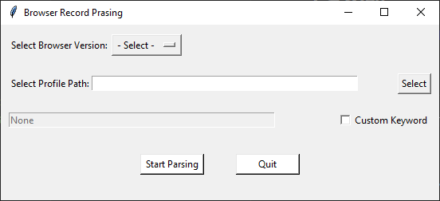

# 浏览器记录解析脚本 (`CLI` 版本)

## 主要功能

1. 解析浏览器用户目录，支持 `Firefox` 类和 `Chromium` 类的浏览器
2. 自动解析 `Cookies` 信息
3. 解析浏览器历史记录
4. 解析用户搜索记录，支持百度、Google、Bing、Yandex、Duckduckgo 等
5. 解析浏览器书签
6. 可指定自定义关键词字典进行额外分析

## 使用方式

通过 `python ./Browser_Record_Parsing_CLI.py -h` 命令获得帮助：

```bash
Usage: Browser_Record_Parsing_CLI.py -b <Browser version (Firefox or Chromium)> -p <Browser profile path> -k <Custom keyword dictionary file>

Options:
  -h, --help          show this help message and exit
  -b BROWSER_VERSION  Specify browser version (Firefox or Chromium)
  -p PATH_NAME        Specify Browser profile path
  -k CUSTOM_KEYWORD   Specify custom keyword dictionary file
```

通过参数 `-p` 指定 Firefox 的 `Profile` 目录，通常在用户主目录下的 `\AppData\Roaming\Mozilla\Firefox\Profiles\` 里面，选取需要分析的即可；

通过参数 `-b` 指定浏览器类型，可选项为 `-b Firefox` 或 `-b Chromium` , 其中 `Firefox`、`Tor Browser`、`Firefox-ESR` 等使用 `Gecko` 内核的属于 `Firefox ` 类型，`Chromium `、`Google Chrome `、`Microsoft Edge `等使用 `Chromium`内核的属于 `Chromium` 类型：

```bash
> python .\Browser_Record_Parsing_CLI.py -p "C:\Users\***\AppData\Roaming\Mozilla\Firefox\Profiles\***.default-esr" -b Firefox
```

指定参数 `-k` 可指定关键词字典文件进行自定义分析：

```bash
> python .\Browser_Record_Parsing_CLI.py -p C:\Users\***\AppData\Roaming\Mozilla\Firefox\Profiles\***.default-esr -b Firefox -k ./keyword.txt 
```

其中，`keyword.txt` (也可以是别的文件名) 的内容按照行进行分隔，一行只保留一个关键词。

如果输出过多，可重定向到某个本地文件，如：

```bash
> python .\Browser_Record_Parsing_CLI.py -p C:\Users\***\AppData\Roaming\Mozilla\Firefox\Profiles\***.default-esr -b Firefox -k ./keyword.txt > ./output.txt
```

# 浏览器记录解析脚本 (`GUI` 版本)

本程序的 `GUI` 版本仅仅是对 `CLI` 版本进行封装，并从 `tkinter` 前端进行调用，核心功能并无不同。

## 主要功能

该程序版本功能与 `CLI` 版本一致。

## 使用方式

运行 `Browser_Record_Parsing_GUI.py`，打开图形界面如下：



在 `Select Browser Version` 处选择浏览器版本，可选项为 `Firefox` 和 `Chromium`，其选择结果将被传递给 `Browser_Record_Parsing_GUI.py `中的 `main()` 函数。

在 `Select Profile Path` 处输入或点击右边的按钮选择对应浏览器的 `Profile` 目录。以下为常用的 `Profile` 目录：

1. Google Chrome： `C:\Users\***\AppData\Local\Google\Chrome\User Data\Default`
2. Microsoft Edge：`C:\Users\***\AppData\Local\Microsoft\Edge\User Data\Default`
3. Firefox：`C:\Users\***\AppData\Roaming\Mozilla\Firefox\Profiles\***.default-esr`

可在下方 `Custom Keyword` 处选择自定义的关键词文件进行自动过滤，其中关键词文件格式应为 `txt` 格式，文件内每一行放置一个关键词，本程序将逐行读取。

自动分析完成后，本程序会将结果保存到当前目录下的 `output.txt` 文件中，并弹出对话框提示，可在对话框中选择是否退出程序。

---

# Browser Record Parsing Script (`CLI` Version)

## Main Function

1. Parsing the user's browser profile directory, support `Firefox` based and `Chromium` based browsers.
2. Parsing the user cookies automatically.
3. Parsing the user's browsing history.
4. Parsing the user's searching history, support Baidu, Google, Bing, Yandex, Duckduckgo, Startpage.
5. Parsing browser bookmarks.
6. Support analyzing the bookmark using customized dictionary file.

## Usage

Get help using `python ./Browser_Record_Parsing_CLI.py -h`:

```bash
Usage: [*] Usage: Browser_Record_Parsing_CLI.py -p <firefox profile path> -c <Custom keyword dictionary>

Options:
  -h, --help         show this help message and exit
  -p PATH_NAME       Specify Firefox profile path
  -k CUSTOM_KEYWORD  Specify custom keyword dictionary file

```

Specify Firefox's `Profile` directory by parameter `-p`, usually in `\AppData\Roaming\Mozilla\Firefox\Profiles` under the user's home directory.

Specify browser version by parameter `-b`, and the options can be `-b Firefox` or `-b Chromium`. For example, browsers such as `Firefox`, `Tor Browser`, `Firefox-ESR`, which are using `Gecko` Kernel should be specified as `Firefox`, and browsers such as `Chromium`, `Google Chrome`, `Microsoft Edge` which are using `Chromium` Kernel should be specified as `Chromium` :

```bash
> python .\Browser_Record_Parsing_CLI.py -p "C:\Users\***\AppData\Roaming\Mozilla\Firefox\Profiles\***.default-esr" -b Firefox
```

When parameter `-k` is specified, a customized keyword dictionary file can be used for custom analytics:

```bash
> python .\Browser_Record_Parsing_CLI.py -p C:\Users\***\AppData\Roaming\Mozilla\Firefox\Profiles\***.default-esr -b Firefox -k ./keyword.txt 
```

The contents in the file `Keyword.txt` (Can be other filenames) should be separated by Return.

If there are too many outputs, you can redirect to a certain file:

```bash
> python .\Browser_Record_Parsing_CLI.py -p C:\Users\***\AppData\Roaming\Mozilla\Firefox\Profiles\***.default-esr -b Firefox -k ./keyword.txt > ./output.txt
```

# Browser Record Parsing Script (`GUI` Version)

The `GUI` version of this program is only a wrapper of the `CLI` version and is called from the `tkinter` frontend, and the essential functionality is no different.

## Main Functon

Absolutely the same as the `CLI` Version. Here's the view of the main window:


## Usage

Select your browser version by clicking `Select Browser Version` buttom, and the options can be `Firefox` and `Chromium`. The result will be passed to the `main()` function in `Browser_Record_Parsing_GUI.py `.

Input your browser profile directory in the inbox, or select your browser profile directory by clicking the `Select` button. Here are the common browser profile directories (Under Windows Operating System):

1. Google Chrome： `C:\Users\***\AppData\Local\Google\Chrome\User Data\Default`
2. Microsoft Edge：`C:\Users\***\AppData\Local\Microsoft\Edge\User Data\Default`
3. Firefox：`C:\Users\***\AppData\Roaming\Mozilla\Firefox\Profiles\***.default-esr`

A `Custom Keyword` check box can be selected for customized filtering and there will be a pop-up window for you to select the keyword file. The file should be `txt` format and the keywords should be placed only one word a row.

When finished parsing, the result will be saved to `output.txt` in current directory and will pop-up a message box, and you can chooose whether to quit the program.
